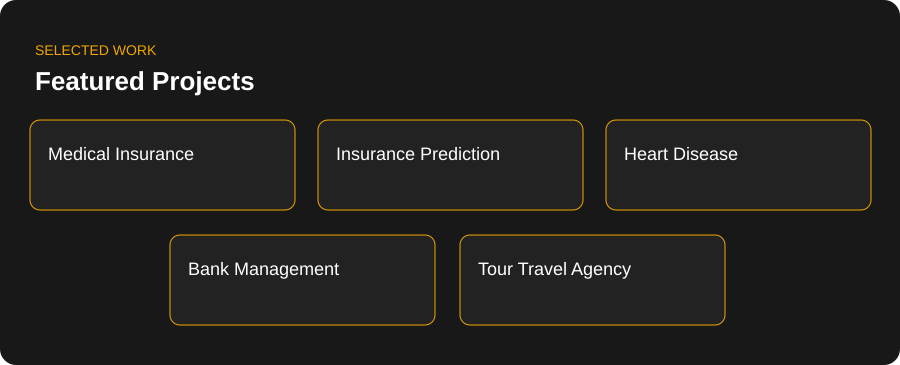

<!-- ========================= HERO ========================= -->

 

  <b>B.Sc. IT Semester 5 Student</b>
  &nbsp; • &nbsp;
  <b>AI / ML Developer</b>
  &nbsp; • &nbsp;
  <b>Python Developer</b>

  Python &nbsp;•&nbsp;
  Machine Learning &nbsp;•&nbsp;
  Deep Learning &nbsp;•&nbsp;
  Data Analysis

 

 

<!-- ========================= ABOUT ========================= -->

<h2 align="center">01 — ABOUT ME</h2>

  Who I am and what I work on

 

 

  <b>B.Sc. IT Semester 5</b> student focused on
  <b>AI / ML, Python, Data Analysis and practical software development.</b>

  Building practical projects with
  <b>Python, Machine Learning, Deep Learning and Data Analysis.</b>

 

<!-- ========================= WORKFLOW ========================= -->

<h2 align="center">02 — AI / ML WORKFLOW</h2>

  From data to prediction and deployment

 

 

<!-- ========================= SKILLS ========================= -->

<h2 align="center">03 — TECHNICAL SKILLS</h2>

  Technologies and concepts I work with

 

 

<!-- ========================= PROJECTS ========================= -->

<h2 align="center">04 — FEATURED PROJECTS</h2>

  Selected projects across AI, ML, software and web development

 

  <b>Featured Project:</b>
  Tour Travel Agency —
  Full-stack travel booking application with user and admin functionality.

  PHP • MySQL • HTML • CSS • JavaScript

 

<!-- ========================= LEARNING ========================= -->

<h2 align="center">05 — CURRENTLY LEARNING</h2>

  Continuously improving my AI / ML and development skills

 

 

<!-- ========================= GITHUB STATS ========================= -->

<h2 align="center">06 — GITHUB ACTIVITY</h2>

  My development activity and contribution journey

 

 

<!-- ========================= JOURNEY ========================= -->

<h2 align="center">07 — LEARNING JOURNEY</h2>

  My journey from learning fundamentals to building projects

 

 

<!-- ========================= CONNECT ========================= -->

<h2 align="center">08 — CONNECT</h2>

  Let's connect and build something meaningful

 

 

  <b>Learn • Build • Experiment • Improve</b>

 

<!-- ========================= FOOTER ========================= -->

